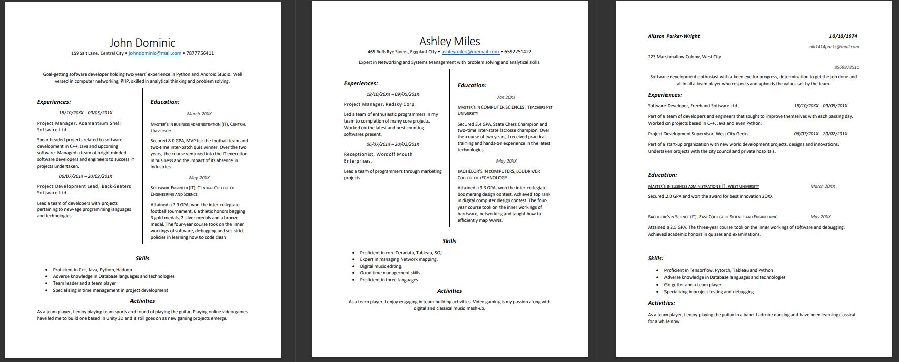
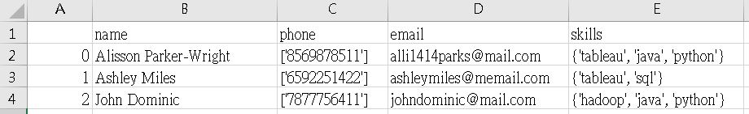

# PythonResumeParser
A python script PDF keyword parser that extracts key info from PDF using NLP techniques with regex and spacy

# Tools & Library Used
Python, pdfMiner, Spacy, regex, pandas

# Project Overview
- used pdfminer to extract text information from multiple pdfs with un-fixed format
- utilized spacy model to tokenize and get needed information using entitiy labels and regex pattern matching from the extracted text (such as name, email, skillset, phone...etc)
- pupolate information into structured tabular format and stored the output with pandas

# Project Demo
1. Orginal input are multiple pdfs all with different format

2. PDF miner is then used to extract plain text from all formats of pdf
3. Plain text will then be procesed with NLP techniques using Spacy and its language model installed
    -  Name and Email can be identified through "entity labels"
    -  Phone and Skills can be identified through regex pattern
4. Populate extracted key info into structured tabular format and stored the output with pandas
    - 
